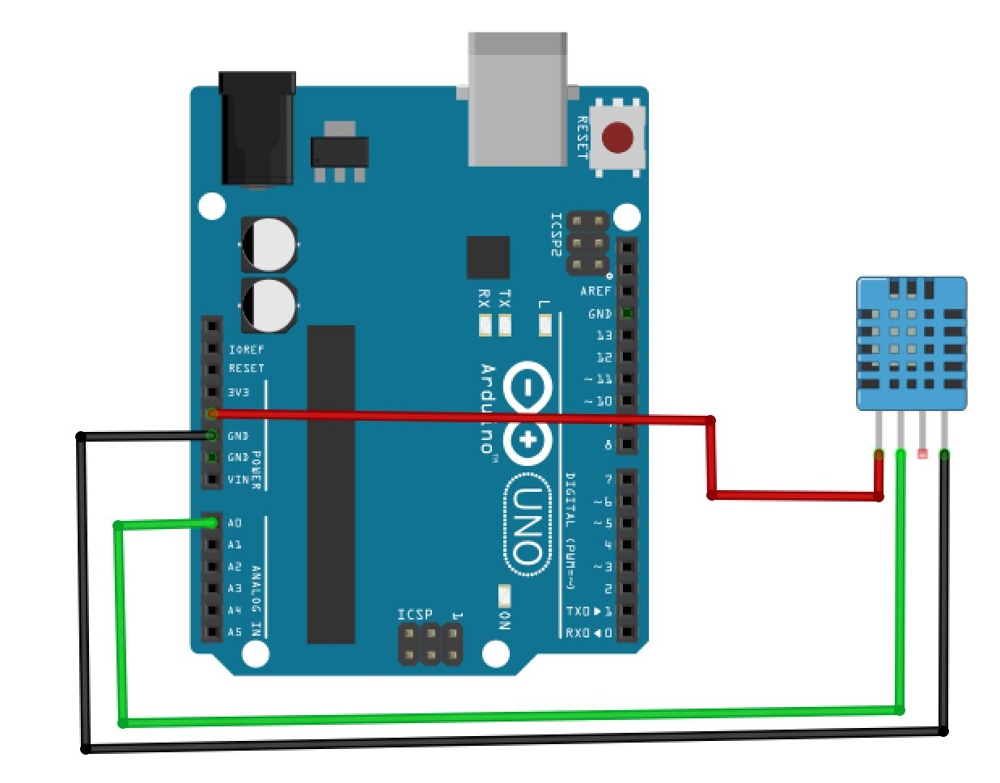

## Proyecto DHT11

El sensor DHT11 está hecho para percibir la temperatura y humedad del ambiente. El sensor está hecho más para prototipos y su sensibilidad puede no ser la más acertada.

## Diagrama de conexión

El diagrama de conexión es el siguiente:

## Referencias adicionales

Dentro del proyecto, puedes descargar el esquema de [Fritzing](http://fritzing.org/home/)

Usar un módulo adaptado al sensor es una gran idea por cuestiones de comodidad. [Este es el utilizado](https://www.330ohms.com/products/sensor-de-humedad-y-temperatura-dht11)