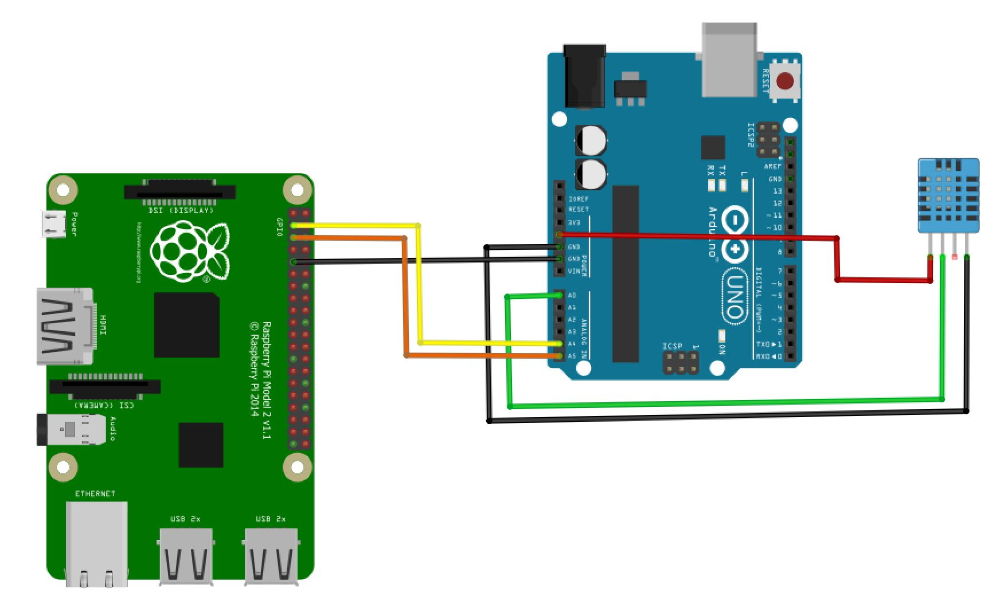

## Proyecto DHT11 en conjunto con I2C

El sensor DHT11 está hecho para percibir la temperatura y la humedad del ambiente. Si quieres aprender las bases de este sensor, puedes hacerlo desde [este proyecto]("https://github.com/aminespinoza/ProyectosArduino/tree/master/DHT11"). En este caso, al obtener la información de cada uno de estos datos la podrás enviar a otro sistema como una Raspberry Pi por medio del bus de comunicación [I2C]("https://es.wikipedia.org/wiki/I%C2%B2C")

## Diagrama de conexión

El diagrama de conexión es el siguiente.

## Referencias adicionales

Dentro del proyecto, puedes descargar el esquema de [Fritzing]("http://fritzing.org/home/").

El sensor utilizado fue un DHT11 pero también puedes hacerlo con el DHT22 únicamente modificando una línea de código en tu proyecto, esta es la línea 6 donde defines que tipo de sensor utilizarás.